# Data Bricks HOL  - Python & Dev Ops
## Hands on Lab – Abstract
This hands on lab is designed for the scenario where a team of scientists and engineers are responsible for the development, maintenance and quality of analytical models which are made available to other teams for consumption.
## Infrastructure Set Up
This section covers all infrastructure between Azure Dev Ops and Azure resources for the HOL which must be completed prior to the lab.
## Azure Resource Creation
Covers the creation of all required Azure resources.
Create Resource Groups
Begin by creating 3 resource groups.
•	[some-name]-db-dev
•	[some-name]-db-pipeline
•	[some-name]-db-prod
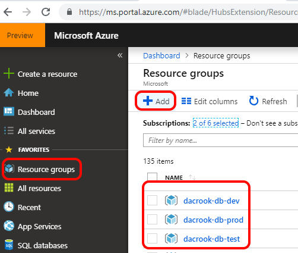
### Adding Resources to Resource Groups
These steps should be completed for resource groups [some-name]-db-dev and [some-name]-db-pipeline.  [some-name]-db-prod will have different resources completely.
#### Add Machine Learning Service Workspace
1.	Select “Add a Resource”.
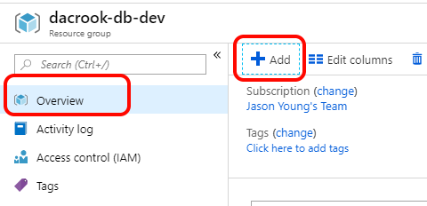
2.	Search for “machine learning” and select “Machine Learning service workspace” published by Microsoft.  Click Create
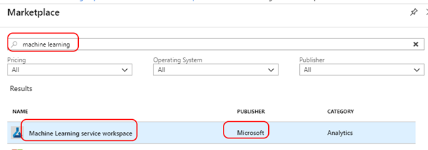
3.	Populate the fields with a naming convention that makes sense to you.  Select the correct resource group and ensure the location pairs with your other services.
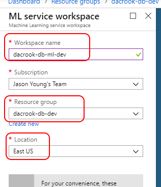
#### Add Data Lake (Azure Storage gen 2)
1.	Select “Add a Resource” form within a resource group pane.

2.	Search for “Storage” and select “Storage account” and click “create”
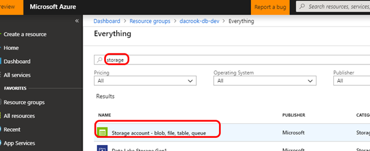
3.	Fill out the creation form.  Ensure you are in the correct resource group.  Give the account a name, ensure it is StorageV2 and set access tier to Cool.

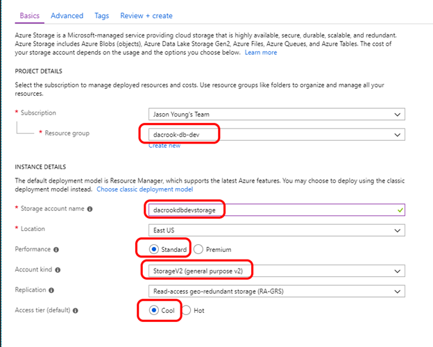
4.	Click on “Advanced” and ensure “Hierarchical namespace” under “Data Lake Storage Gen2” is selected as “enabled”.
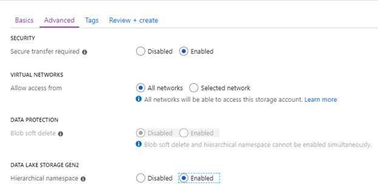
5.	Select Create
#### Add Azure Key Vault
1.	Select “Add a Resource” from within a resource group pane.

2.	Search for “key vault” and select “Key Vault” published by Microsoft.
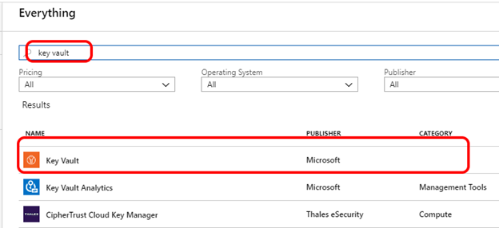
3.	Populate the creation form.  Give a name that is easy to remember and ensure the resource group is the desired resource group as well as the location.
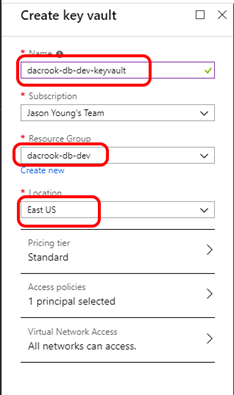
#### Add a DataBricks Cluster
1.	Select “Add a Resource” from within a resource group pane.

2.	Search for DataBricks and select the one published by Microsoft.  Click “create”.
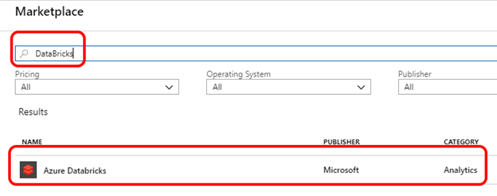
3.	Complete the Form for Creation using [some-name] as the workspace name, the resource group you are operating in for the resource group, select a location and ensure pricing tier is “Premium”.  We will be using RBAC controls.  
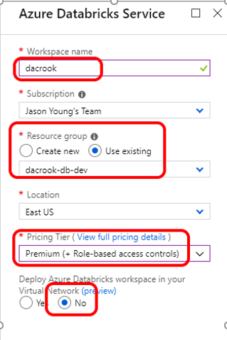
4.	Navigate back to your resource group and select your newly created workspace
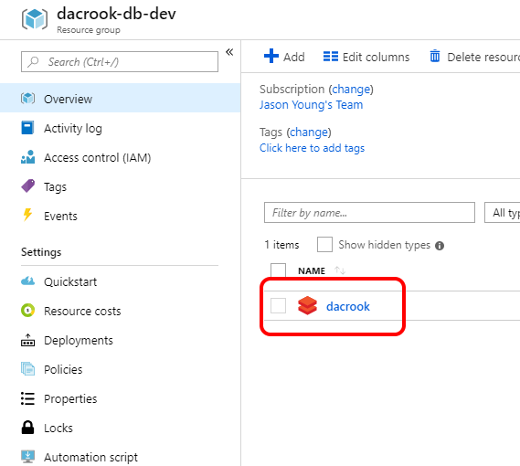
5.	Select to “Launch Workspace” – Do not use the URL link. In the top right.
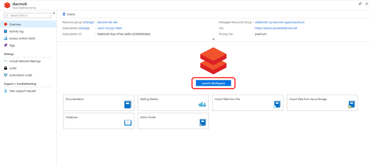
6.	On the left hand pane, select “Clusters” and then “Create Cluster”
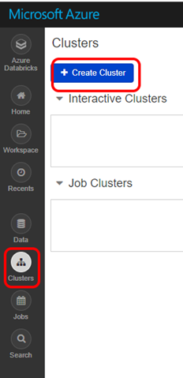
7.	Fill out the creation form.  MAKE SURE you select “terminate after 120 minutes of inactivity” to help reduce accidental usage and billing.
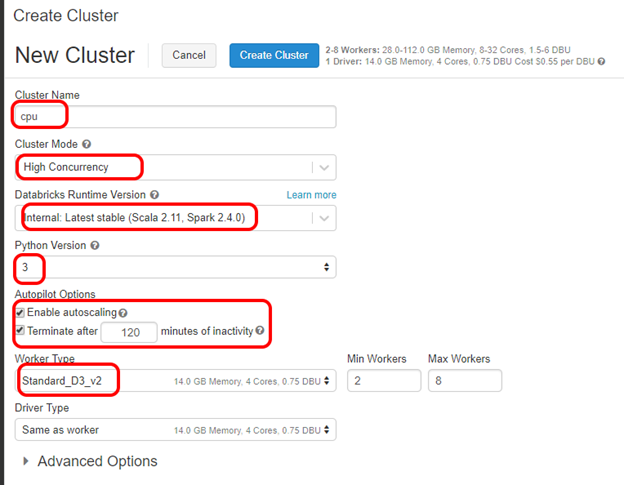
#### Add AzureML SDK as Library to Cluster.
1.	From the DataBricks Workspace, click on “Clusters” and then the cluster name.
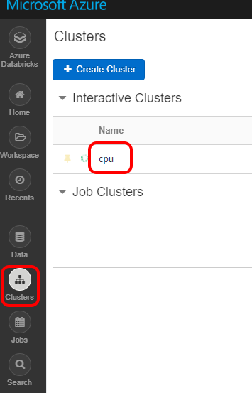
2.	Click on the Libraries Tab, Install New, PyPl and enter “azureml-sdk”.  Click Install
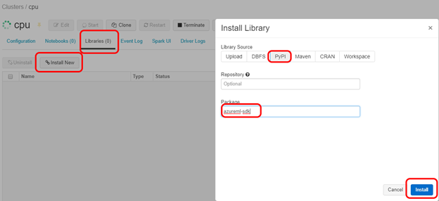
#### Add Initial Data to Storage
We want to ensure there is some data in the various data lakes so folks can access it.
1.	Download the file: https://amldockerdatasets.azureedge.net/AdultCensusIncome.csv 
2.	Select the storage v2 from your resource group.
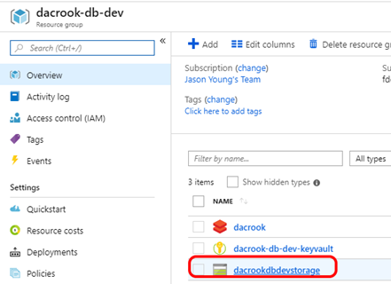
3.	Select Storage Explorer (Preview)
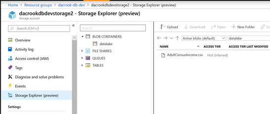
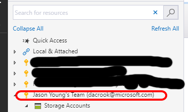
4.	Expand the expand “Blob Containers”.  Right Click Blob Containers and select “Create Blob Container”

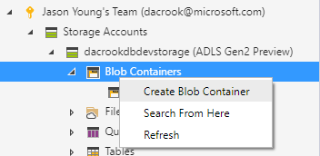
5.	Name the container “datalake”
6.	Locate the AdultCensusIncome.csv file you downloaded previously.
7.	Drag & Drop the file into the pane of the container
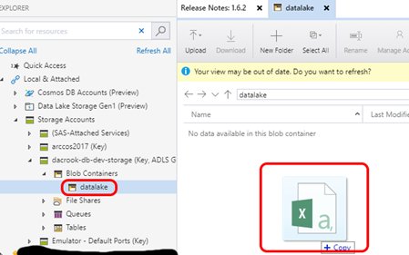
8.	Select “Refresh”.  You should see the .csv show up in the pane.
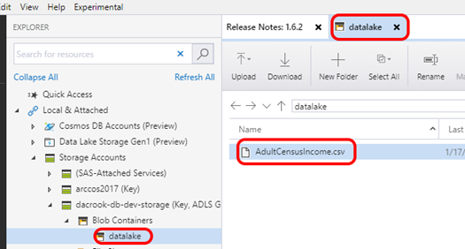
#### Create Secrets for Secure & Controlled Storage Mounts
We parameterize out a few extra values such that the code for mounting data can remain the same regardless of which databricks cluster it is attached to and the access to data is controlled by a cluster & data lake admin instead.  These steps should be completed for each databricks workspace within each resource group.
##### Install Azure & Data Bricks CLI
1.	Ensure python 3.x is installed.
a.	If it is not; the easiest way is to install Anaconda.
b.	https://www.anaconda.com/download/ 
2.	Install the data bricks cli
a.	Open a cmd prompt and execute the command: “pip install databricks-cli”
3.	Install the azure cli
a.	Open a cmd prompt and execute the command: “pip install azure-cli”
##### Configure Data Bricks CLI for User
###### Generate a User Access Token
1.	Launch the DataBricks Workspace from the Azure Portal

2.	In the upper right hand side of the screen, select the user icon.
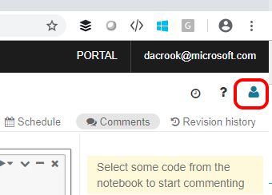
3.	Select “User Settings” from the drop down.
4.	Select “Generate a New Token”
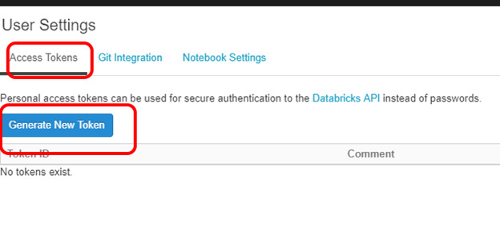
5.	Give a good comment and remove the token lifetime (gives permanent token access to cluster; not a best practice)
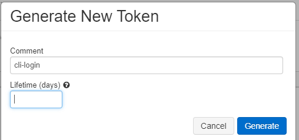
6.	Copy the token that gets generated.
###### Authenticate CLI with Token using Profiles
1.	Use the command “databricks configure --token --profile [PROFILENAME]
a.	HINT: use dev, test & prod similar to how you named the workspaces and resources groups to more easily differentiate.
2.	Enter the host URL
a.	https://eastus.azuredatabricks.net (example)
b.	Paste the token generated from the previous step
3.	To use the profiles capability; simply use the –profile flag with the [PROFILENAME] configured to configure the workspace you are targeting.
###### Create Service Principal and Give Access to Data Lake
This section uses an AD Service principal and provides access to the principal for the data.
1.	Login in to the azure cli by executing the command: “az login”
a.	Follow instructions printed out.
2.	Create a service principal by executing the command: “az ad sp create-for-rbac –name [SOMENAME]”
a.	Copy the app id
b.	COPY the password – you will not be able to get it again.
3.	Get the Service Principal’s object id by executing the command: “az ad sp show –id [AppId]”.  Search through the result and find the value of the property “objectId”
b.	Copy the objectID
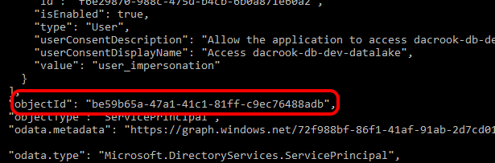
4.	Open Azure Storage Explorer and right click the datalake container you created previously.  Select “Manage Access”
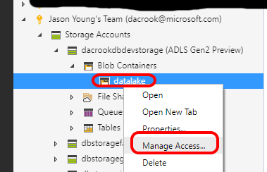
5.	Paste the objectID into the text box and click “Add”
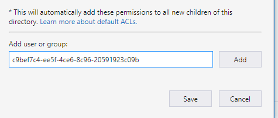
6.	Find the object ID in the list, click on it and give it Read, Write & Execute Access as well as Default.  Click Save
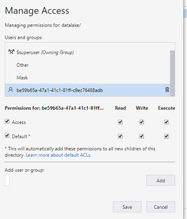
7.	Navigate to the Azure Portal and to the ADLS Gen Two Blade for this resource group.  Click on Access Control (IAM)
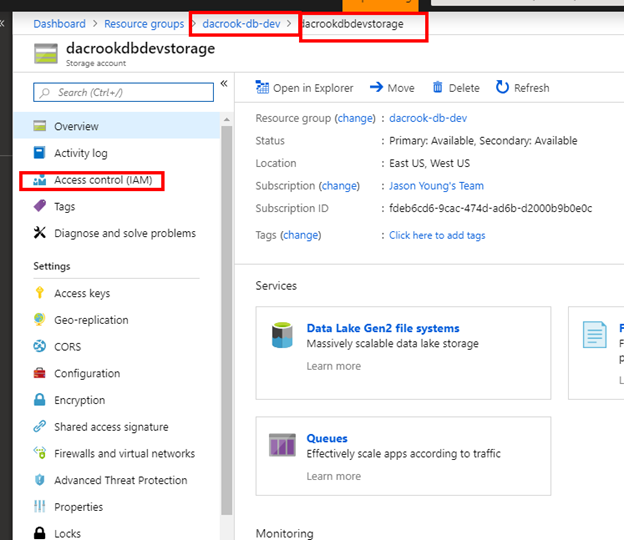
8.	Click on “Add” “Add role assignment”
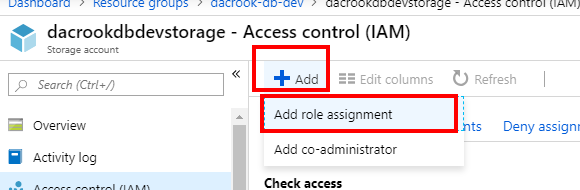
9.	The role should be: “Storage Blob Data Contributor” and enter the name for the service principal for this resource group you created and click save.
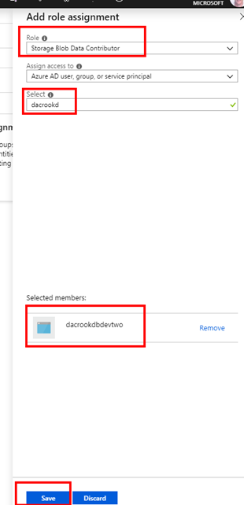
###### Create an Azure Key Vault Backed Secret Scope
1.	Navigate to your workspace with the following format:
a.	https://eastus.azuredatabricks.net/?o=6776691945951303#secrets/createScope 
b.	Replace the number after o= with yours:
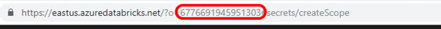
c.	Or simply append #secrets/createScope to the end of the url of your workspace.
2.	Navigate to the key vault for the resource group you are setting up:
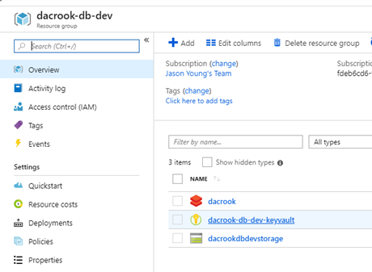
3.	Copy the DNS name
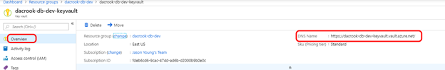
4.	Copy the Resource ID
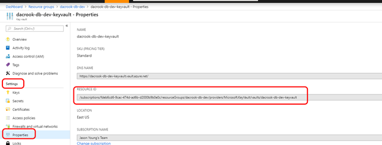
5.	Name the scope “data-lake”, set for “All Users”.  Populate the dns name and resource id of the key vault. And select “Create".
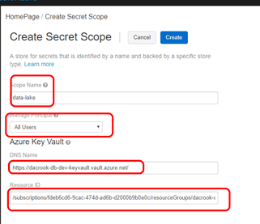
6.	From the databricks CLI, enter the command: “databricks secrets list-scopes –profile [YOUR PROFILE]
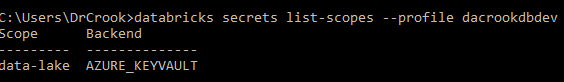
###### Add Secrets to Secret Scope for Accessing Data
You will need the Service Principal’s password and app id from the previous steps.
1.	Get the app’s tenant id by executing the following command: “az ad sp show –id [AppId]”
a.	Copy the value from: “appOwnerTenantId”.
2.	Add the Service Principal’s TenantID to the Azure Key Vault
a.	“az keyvault secret set –vault-name [KeyVault for RG] –name “sp-tenant-id” –value [TenantId]”
3.	Add the Service Principal App-ID to the Azure Key Vault
a.	“az keyvault secret set –vault-name [KeyVault for RG you are configuring] –name “sp-app-id” –value [service principal’s app id]
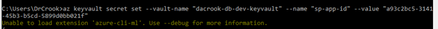
4.	Add the Service Principal’s password to the Azure Key Vault
a.	“az keyvault secret set –vault-name [KeyVault for RG] –name “sp-password” –value [password copied from earlier]
5.	Add the Service Principal’s token endpoint
a.	https://login.microsoftonline.com/<YOUR appOwnerTenantId>/oauth2/token
b.	“az keyvault secret set –vault-name [KeyVault for RG] –name “sp-token-endpoint” –value [token endpoint]
6.	Add the FQDN of the data lake.
a.	“az keyvault secret set –vault-name [KeyVault for RG] –name “datalake-fqdn” –value “abfss://datalake@YOURSTORAGEACCOUNT.dfs.core.windows.net”
7.	Verify secrets are in the data-lake scope for databricks
a.	“databricks secrets list –scope data-lake”

#### Azure Dev Ops – Creation 
This section covers creating a project in Azure Dev Ops for the workshop.
1.	Navigate to https://dev.azure.com 
2.	Select the organization you intend to use OR create a new organization.
3.	Create a new project.  Pick a name, description.  Select “Git” for version control and “Agile” for the work item process.
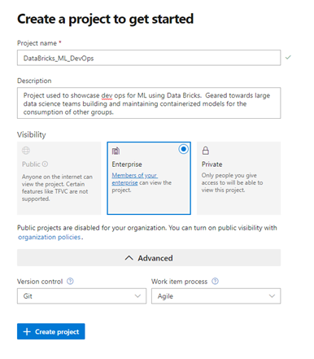
4.	Invite Additional Users
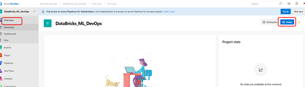
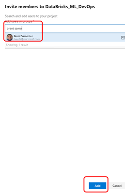
5.	Click on Repos, Files.
6.	At the very bottom, select “Initialize Repo”.
##### Scientists – Initial Setup
Configure Azure Dev Ops Integrations
 Azure Databricks, set your Git provider to Azure DevOps Services on the User Settings page:
1.	Click the User icon   at the top right of your screen and select User Settings.
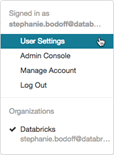
2.	Click the Git Integration tab.
3.	Change your provider to Azure DevOps Services.
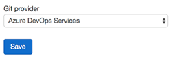
##### Create & Link Project File w/ Repo
1.	From inside the Data Bricks cluster interface, select workspace, shared, then the drop down, then create and create a “Folder”
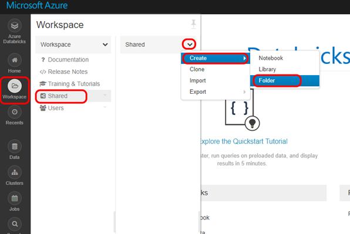
2.	Name the folder “Project_One”
3.	Create a new file inside the project called “train_model”.
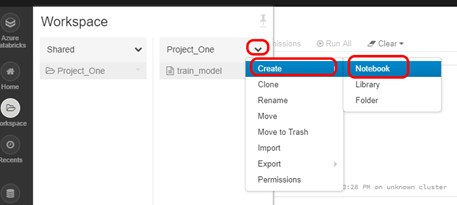
4.	Link “train_model.py” file to your Azure Dev Ops repository.
a.	Copy the git link from your azure dev ops portal:
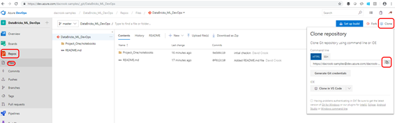
b.	Paste into the “link” location in the popup for “Git Preferences”
c.	Create a new branch.  Name it your unique user ID
d.	Use “Project_One/notebooks/train_model.py” as the path in git repo.

# Dev Loop Experience
The dev loop experience encompasses mounting the dev data, exploring that data, training a model; writing the inference code, compiling a dev container; running tests inside the dev container.
## Train the world’s worst regression & Stage for inference coding.
1.	Copy the code from Project_One/notebooks/train_model.py into your databricks train_model.py which was created earlier.
1.  The proctor will step through what exactly the code is doing and why.
    1.  Essentially: The precreated secrets are being used to mount to various stores securely and will allow zero code changes as the algorithm progresses across secure environments.  
    2.  You train a super simple algorithm and register the resulting model files with the AZML service such that we can bridge the divide between databricks and inference coding.  This process is ML Framework independent and can be used cross algorithms, frameworks etc.
## Inference Coding
This section extends from having a trained model to now building an inference container which is reflective of the asset we will deliver to our customer base.
Code Structure
Good Code Structure from the beginning is a great way to ensure you are set up well.  In this case we are going to follow well defined development strategies via a bit of a hybrid between .net project structures and python project structures.
 
We have two folders for each project.  Project_One is the primary inference project
### Git Pull the train code
1.	Open a cmd prompt.
2.	Change directory into the root of where your project is.
3.	Execute the command:
a.	“git checkout <YOURBRANCHNAME>”
b.	“git pull”
### Test Driven Development
You should always start with testing and then writing code to satisfy those tests.  The only code which will be required to write is the test_model.py.  The facilitation code here is provided for you.
 
Inside this file we will write a very simple unit test to ensure that the x_scaler object is populated during model initialization.

1.  An example unit test has already been written.  Add 1 more unit test to Project_One-Tests/test_model.py.
2.  The facilitation code follows standard pytest rules, so you can even add more test files etc; just follow pytest conventions.
3.  The proctor will run through how the project works.
    1.  Project_One is the project code which seperates the inference code as a "provider" type class following similiar principals from the testable web dev space.  
    2.  Project_One-Tests is your seperated testing code such that it is not coupled with your app development code.
    3.  A container is built for the inference code, which is then extended with the test code.  The base inference container is the asset expected to be deployed while the extended testing container allows you to test the assets in the same type of format as if they were to be compiled.

We now have inference code with matching train code.  Lets build the inference container and test it.
### Build Inference Container
1.	First open runbuild_local.cmd
a.	Modify the environment variables to match for the dev environment.  These will remain constant for this algorithm and your local environment.
i.	Subscription_id
ii.	Ml_resource_group
iii.	Ml_workspace_name
iv.	Ml_alg_author
From the command prompt:
1.	Change directory into the Project_One folder.
2.	Run the runbuild_local.cmd
a.	You may need to execute az login prior to executing this command or be interactively logged in (watch the output)
b.	 
c.	This will execute a bunch of stuff and be on “Creating image” for a while.  Occasionally hit enter to see if the cmd prompt output is up to date or not.
d.	 
### Test Inference Container
1.	Change directory into the Project_One-Tests folder.
2.	Run the runtests_local.cmd file
3.	This will extend the container you created in the previous step, run your unit tests and check your code coverage.  The code coverage results can be found in C:/ml_temp/artifacts/test_results  These are standard pytest and pytest-cov result outputs.
4.	 
5.	Click on index.html from cov_html folder
6.	 
7.	We have 68% code coverage; could be worse.
## Commit & Pull Request.
1.	We now know that we have an inference container and it passes our unit tests and our code coverage is to a point where we are happy about it.
2.	From the command prompt change directory to the root of the repository.
3.	Execute the following commands to push the changes from your branch:
a.	Git add ./
b.	Git commit -m “works”
c.	Git push
4.	Create a pull request by going to your ADO site, under repos, pull request, New Pull Request
 
5.	Populate the request template and ensure you have a reviewer:
 
6.	Review the changes with the reviewer you selected.  Ensure both enter ADO and hit “Approve” and then “Complete”.  If you see problems in your peers code; add comments and reject it.  Once both reviewers Approve you can complete.  This will launch the build pipelines & release pipelines which are connected to master.
 
# Defining your Build Pipeline

Since we are targeting a different Azure Databricks Environment than the one used in the local Dev Loop described earlier in this document, and since we are concerned with security we will be creating a library asset which will allow us to define secrets from a key vault that points to this new environment. These secrets become available as variables in the build pipeline. Variables give you a convenient way to get key bits of data into various parts of the pipeline. As the name suggests, the value of a variable may change from run to run or job to job of your pipeline. Almost any place where a pipeline requires a text string or a number, you can use a variable instead of hard-coding a value. The system will replace the variable with its current value during the pipeline's execution.

## Creating a Variable Group

1.	In your Azure DevOps Subscription navigate to the Library Menu Item and click + Variable Group

 
 
2.	Name your variable group as indicated and select the Azure Subscription and KeyVault that you wish to target and toggle the “Link secrets from an Azure key vault as variables” switch to the on position
 
 

3.	Click the + Add button, select the variables that you want to make available to the pipeline, click ok and then Save to make sure that your changes are persisted to your Azure DevOps instance
 

## Create a Build Pipeline in the Visual Designer

The intention of this step is to create an Azure DevOps Pipeline that will mimic the steps from the Local Build Loop, but targets a different Azure Databrick Environment for the training .The connection details of this environment will not be available to the scientists directly and will be managed by the operations team. This pipeline will execute when a PR to master is approved and completed.
1.	In your Azure DevOps tenant, navigate to Pipelines -> Builds and click on + New and select New build pipeline.
 
 
2.	Select your source and make sure to select the master branch as we want to make sure that the pipeline is attached the branch that we will be monitoring for Pull Requests. Click Continue.
 
3.	Select Empty Job 
 
4.	Name your Pipeline accordingly and select the Hosted Ubuntu 1604 Build Agent from the Agent Pool.
 
5.	Link the variable group that you created earlier by clicking on Variables in the menu bar, followed by Variable groups and click Link Variable Groups.
 
6.	Select the Staging Environment Variable Group and Click Link. Your pipeline now has access to all the runtime environmental variables to connect to the Staging Environment.

 
7.	Click back onto Tasks on the menu and click +on the Agent Job to Add the Tasks that you will be configuring for the build process.

 
 
8.	Type “CLI” in the Search Box and Click the Azure CLI”ADD” button four times.
 

Your Agent Job Step should look like the following when you have completed.

 

 
9.	Repeat Step 8, substituting the Search for “CLI” with Copy and add two Copy Files Tasks. 

 

10.	Substitute “Copy” with “Test” and add a Publish Test Results Task
 

11.	Substitute “Test” with Coverage and add a Publish Code Coverage Results Task.
 
 Your Agent Job should now resemble the following:
 

12.	The First Azure CLI Task will be used to configure the agent environment and make sure that the required packages are installed to execute the rest of the pipeline. Provide the task with a descriptive name, Select the appropriate Azure Subscription, set the Script Location to “Inline Script” and add the flowing to the inline script window:
pip3 install -U setuptools
python3 -m install --upgrade pip
pip3 install --upgrade azureml-sdk[notebooks]
Set the remainder of the task properties as depicted below:
 
 

13.	Click on the second Azure CLI Task, select the appropriate Azure Subscription and configure as follows:
Display Name	Train Model
Script Location	Inline Script
Inline Script	python3 Project_One/notebooks/submit_run_db.py
Access service principal details in script	Checked
Use global Azure CLI configuration	Checked
Working Directory	

14.	Click in the third Azure CLI Task , select the appropriate Azure Subscription and configure the Task as follows :
Display Name	Build Inference Container
Script Location	Inline Script
Inline Script	#Creating Artifact and Test Results Directories
mkdir ml_temp && cd ml_temp
mkdir artifacts && cd artifacts
mkdir test_results

#Switching to Project Directory
cd /
cd $(System.DefaultWorkingDirectory)/Project_One

#Docker Build Inf Container
echo "Building Inference Container"
docker build -t mlbuild .

#Run Built Container
echo "Running Inference Container"
docker run -e SUBSCRIPTION_ID=$(subscription-id) -e RESOURCE_GROUP=$(resource-group) -e WORKSPACE_NAME=$(ml-workspace-name) -e STATE=$(alg-state) -e AUTHOR=$(author) -e MODEL_NAME=$(model-name) -e IMAGE_NAME=$(image-name) --name mlbuild --rm -v $(Agent.HomeDirectory)/ml_temp/artifacts:/artifacts/ -v /home/vsts/.azure/:/root/.azure/ mlbuild
Access service principal details in script	Checked
Use global Azure CLI configuration	Checked
Working Directory	$(Agent.HomeDirectory)
The contents of inline script can be found in the Repo at Project_One/runbuild_pipeline.sh
15.	Click the fourth Azure CLI Task, Select the appropriate Azure Subscription and configure the Task as follows:
Display Name	Run Unit Tests
Script Location	Inline Script
Inline Script	cd ml_temp/artifacts
str=$(jq -r '.image_location' artifacts.json)

echo "################### Image to be tested ################### : " $str
cd /
cd $(System.DefaultWorkingDirectory)/Project_One-Tests
echo "################### Updating Tests Docker File ################### "
sed "s|<AZMLGENERATEDCONTAINER>|${str}|g" dockerfile.base > dockerfile

echo "################### Logging into ACR ################### "
docker login $ACR_NAME -u $ACR_USER -p $ACR_PASSWORD 
echo "################### Building MLTESTS Image ################### "
docker build -t mltests .
echo "################### Running MLTests Container and Conducting Tests ################### "
docker run --name mltests -v $(Agent.HomeDirectory)/ml_temp/artifacts/test_results:/var/azureml-app/tests/junit mltests
echo "################### Ending Test Sequence ################### "
sudo chown -R $(id -u):$(id -u) $(Agent.HomeDirectory)/ml_temp/artifacts/test_results/cov_html/
Access service principal details in script	Checked
Use global Azure CLI configuration	Checked
Working Directory	$(Agent.HomeDirectory)
The contents of inline script can be found in the Repo at Project_One-Tests/runtests_pipeline.sh

16.	Click on the first Copy Files Task and configure the task as follows:
Display Name	Copy Files to: $(build.artifactstagingdirectory)
Source Folder	$(Agent.HomeDirectory)/ml_temp/artifacts/
Contents	**
Target Folder*	$(build.artifactstagingdirectory)

 
 

17.	Click on the second Copy Files Task and configure the task as follows:
Display Name	Copy Files to: $(build.artifactstagingdirectory)/test_results
Source Folder	$(Agent.HomeDirectory)/ml_temp/artifacts/test_results
Contents	**
Target Folder*	$(build.artifactstagingdirectory)/test_results

 
18.	Click on the Publish Test Results Task and Configure the task as follows:
Display Name	Publish Test Results test-results.xml
Test result format*	JUnit
Test result files	test-results.xml
Search Folder*	$(Agent.HomeDirectory)/ml_temp/artifacts/test_results

 
19.	Click on the Publish Code Coverage Task and configure the task as follows:
Display Name	Publish code coverage from $(Agent.HomeDirectory)/ml_temp/artifacts/test_results/coverage.xml
Code Coverage Tool*	Cobertura
Summary File	$(Agent.HomeDirectory)/ml_temp/artifacts/test_results/coverage.xml
Report Directory	$(Agent.HomeDirectory)/ml_temp/artifacts/test_results/cov_html

 
20.	 On the Agent Job Click the + in order to add a task that will be used to publish the build artifacts for use in a release pipeline later.
 
Search for Publish and Click “Add” on the Publish Build Artifacts Task
 

Configure the task as follows:
Display name	Publish Artifact: PipelineArtifacts
Path to publish	$(Build.ArtifactStagingDirectory)
Artifact name	PipelineArtifacts
Artifact publish location	Azure Pipelines/TFS

 
21.	Enable the Continuous Integration trigger on the pipeline which will make sure that every time a change in made to the master branch of the repository this pipeline will execute. Click the Triggers menu item in the menu bar and click the checkbox to enable continuous integration.
 

You can now Save and Queue this pipeline for a manual build to make sure that it executes from end to end without any issues. 

Output from the pipeline should resemble the following: